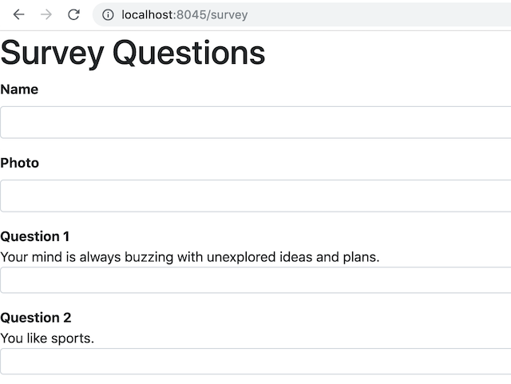

# FriendFinder - Node and Express Servers

### Overview

FriendFinder is a full-stack application that matches friends based on the compatibility of each users' serveys.  The user is  brought to a landing page and then asked to begin a survey.  Each survey is comprised of 10 questions, meant to guage the user's personality and interests. Answers are scored between 1 to 5 based on how much the user agrees or disagrees with a question.  The app compare the user's answers with those from other users, and will then display the name and picture of the user with the best overall match.

### About
This app uses Express, in conjunction with Node.js, to handle the server routes for get and post requests. Being that it is full-stack, it is hosted on Heroku.

### required npm packages

`express`, `path` 

## Getting Started

The user arrives at a landing page.  Click the button to go to survey.


If you click on the `Friend List API` link on either the landing page or survey page, it will show you all the users data in JSON format.


```json
{
  "name":"Ahmed",
  "photo":"https://media.licdn.com/mpr/mpr/shrinknp_400_400/p/6/005/064/1bd/3435aa3.jpg",
  "scores":[
      5,
      1,
      4,
      4,
      5,
      1,
      2,
      5,
      4,
      1
    ]
}
```
## Fill out Survey



Notice that the url says `/survey` when you go to the survey page.  This is Express handling the different html routes.

## Meet your match

Once you input all your scores, they will be calulated against other users scores to bring back to closest possible match.


### Technologies Implemented

* Bootstrap
* Express
* Node.js
* Heroku

### Live site

* deployed: https://pacific-citadel-60833.herokuapp.com/


